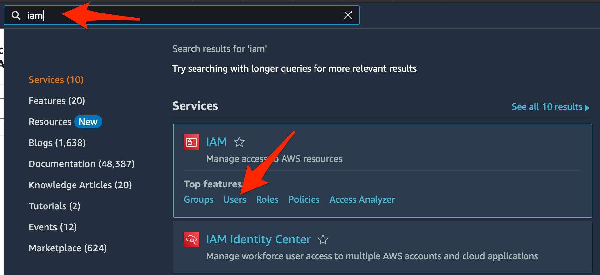
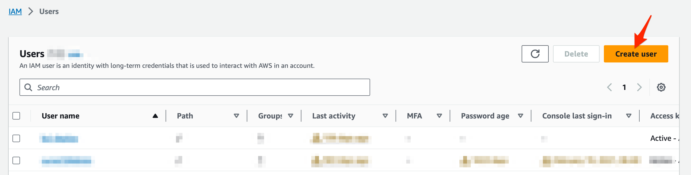
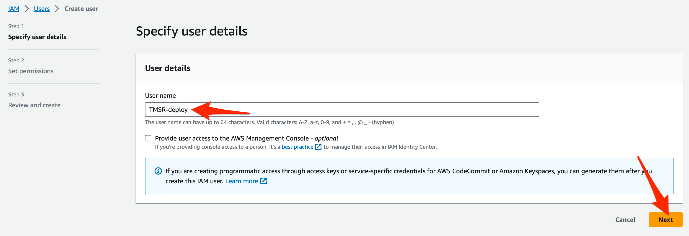
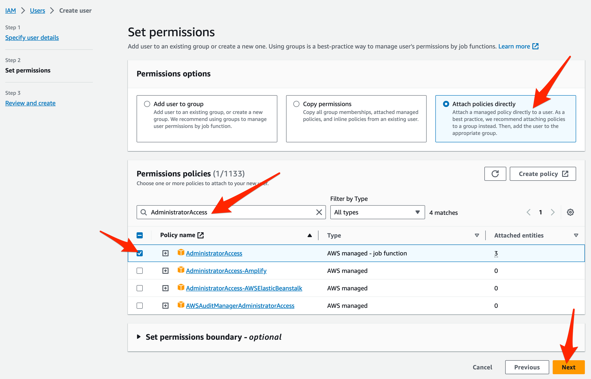
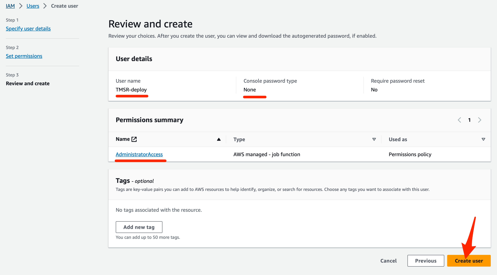
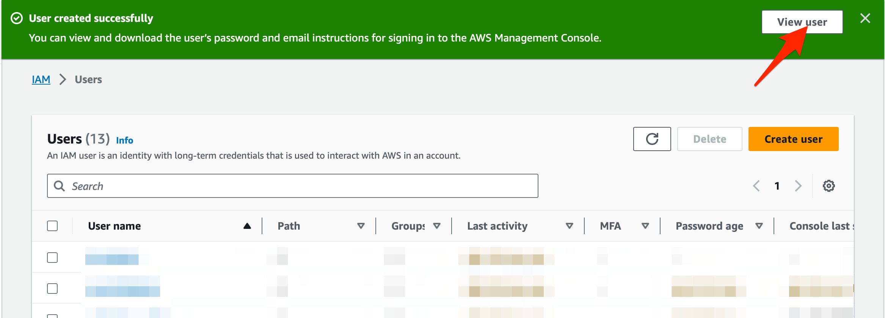
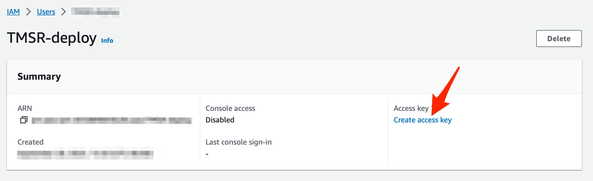
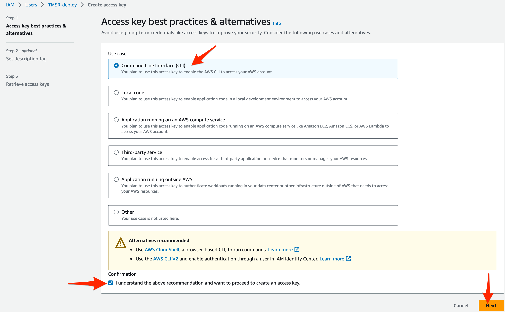
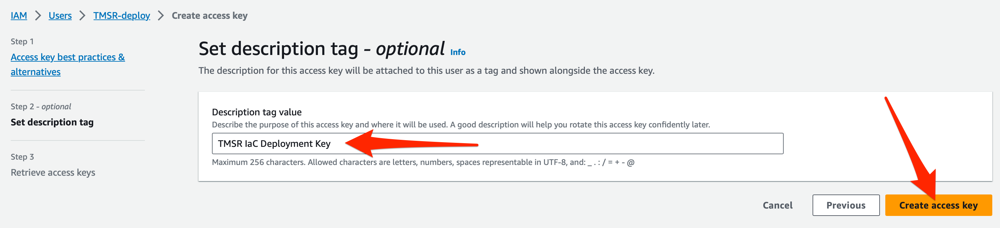
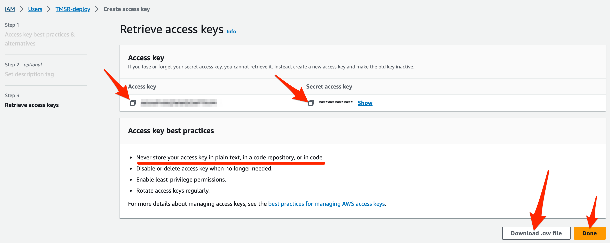

# AWS CLI Credentials

[Prereqs](../README.md)

## Best Security Practices

Never store any files or pieces of information that contain credentials or keys! You'll expose your data and infrastructure to nefarious actors, and could lead to unwanted AWS fees.

## Create AWS CLI Credentials

If your organization doesn't have an AWS account coordinator/administrator that can provide CLI credentials, use the following steps to generate a dedicated user for deploying cloud infrastructure using a `AWS_ACCESS_KEY_ID` and `AWS_SECRET_ACCESS_KEY`

1. Search for `IAM` and click `Users` when it appears after hovering over the search result.   
 

2. Click `Create User` 
 

3. Use naming convention `<PROJECT PREFIX>-deploy` to create your `IAM` user and click `Next` 
 

4. Select `Attach polices directly` and search `AdministratorAccess`. Check the box next to this policy and click `Next` to apply administrative access to the deployment user.  
  

5. Click `Create User`  
 

6. Upon success click `View User` to begin generating the deployment users' AWS access key. 
 

7. Click `Create access key`  
 

8. Select `Command Line Interface (CLI)` and check the `I understand....` box. Click `Next` to proceed.  

9. Add a description like: `<PROJECT PREFIX> Iac Deployment Key` so that the deployment users' purpose is clear. 
 

10. Copy and paste the `Access key` and `Secret access key` values in a safe location outside of the repo.

11. Click `Download .csv file` and save the resulting `.csv` file as a back up in a safe location. 
 

