# Mongo DB

This document outlines how to set up MongoDB securely for STAGE and PROD environments. After signing up for an account on MongoDB.com, follow this process to create two databases on seperate projects for each stage in the development pipeline - i.e STAGE and PROD.

[Prereqs](../README.md)

## Sign Up for MongoDB.com Account

Sign up for a new account on MongoDB.com. After passing account verification and the user questionnaire, you will be presented with the `Deploy your database` screen.

Click `I'll deploy my database later` as it will take fewer steps to create multiple database projects manually.

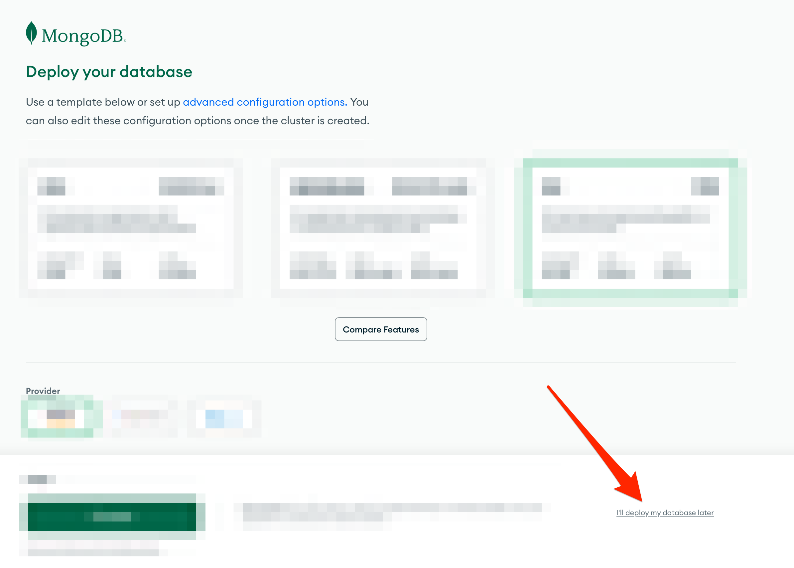

## Creating DBs for Each Environment

The procedure covers setting up a database for one state pipeline at a time. First, step through the entire process to create a database for the STAGE pipeline, then again to deploy a production database for the PROD pipeline.

1. Select the the `Projects` drop down menu and then click the `+ New Project` button.

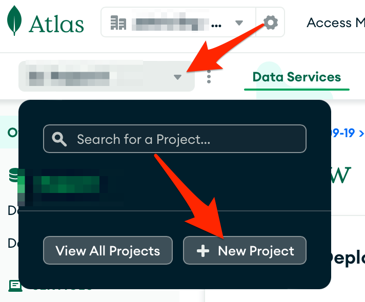

2. Using the naming convention `<PROJECT PREFIX>-<Environment>`, name the project that will hold the associated database. For example, a project prefix of `TMRS` and the stage environment results in: `TMRS-Stage`. For production you'd use: `TMRS-Prod`.

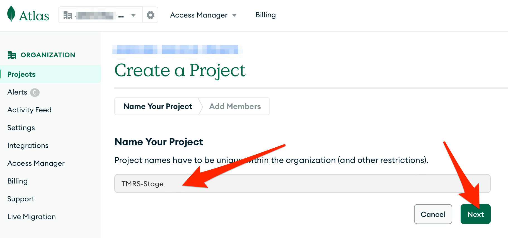

3. Accept the defaults on the next screen and click `Create Project`.

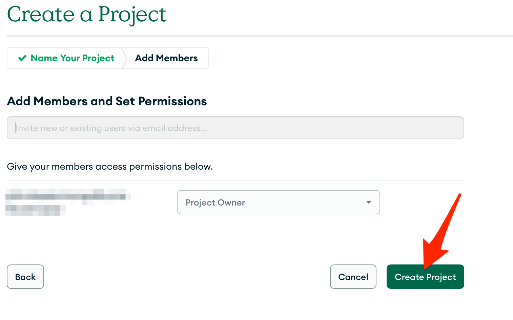

4. On the `Overview` screen Click `+ Create`

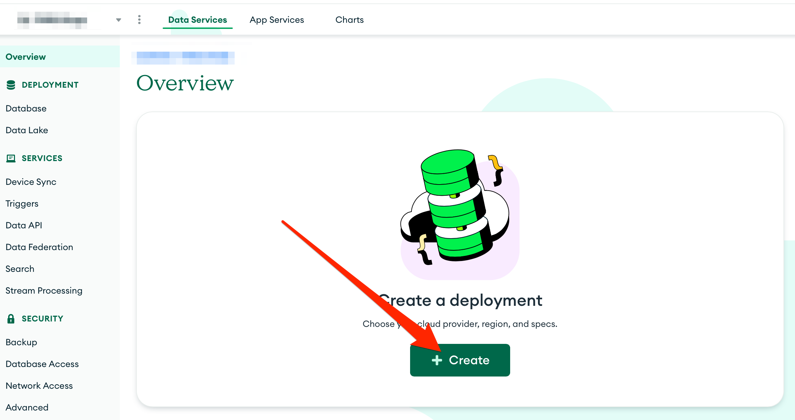

5. Select the `FREE` tier to get started. You can  resize as needed later.

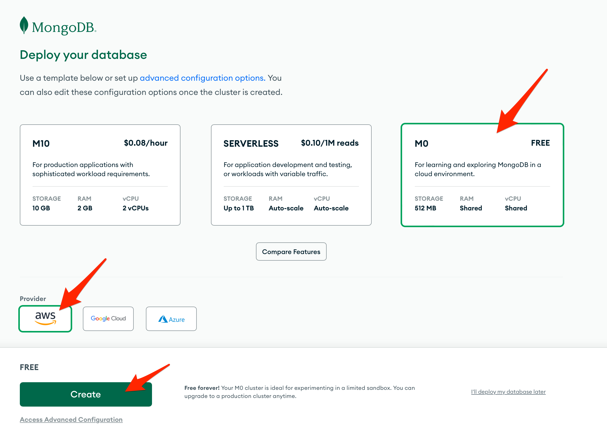

6. Create a system `username` and `password` that will be used by the code in this repo to perform read/write/query operations on the mongo database.

7. Change username to `service`

8. Copy and save the provided password in a safe location outside of the code.

9. Click `Create User`

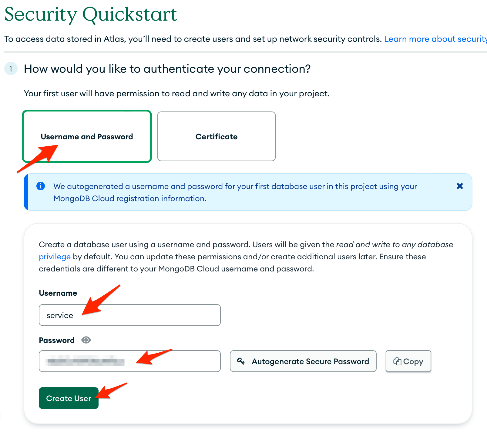

10. Scroll down and Select `My Local Environment` and click `Add My Current IP Address` if your IP address is not displayed below the IP Entries list

11. Click `Finish and Close` and then click `Go to Overview` in the resulting pop up.

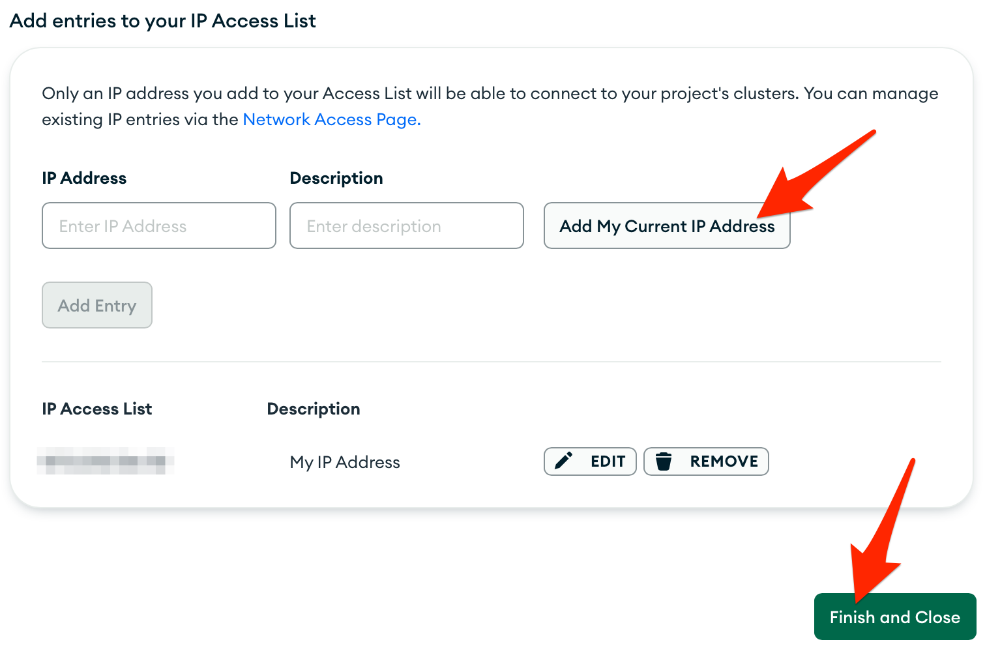

12. The `Overview` screen will load. Click `Connect` and select `MongoDB for VS Code` in the resulting pop up.

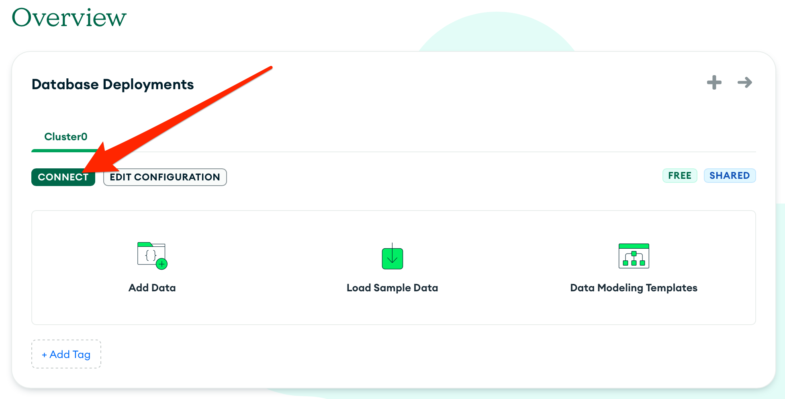

13. Copy the string under the `Connect to your MongoDB deployment` section, which looks similar to: `mongodb+srv://service:<password>@cluster0.z5kgnsf.mongodb.net/

14. Save this string in a safe location outside of the repo and subtitute the `<password>` segement of the string with the password saved from `Step 4` above.`

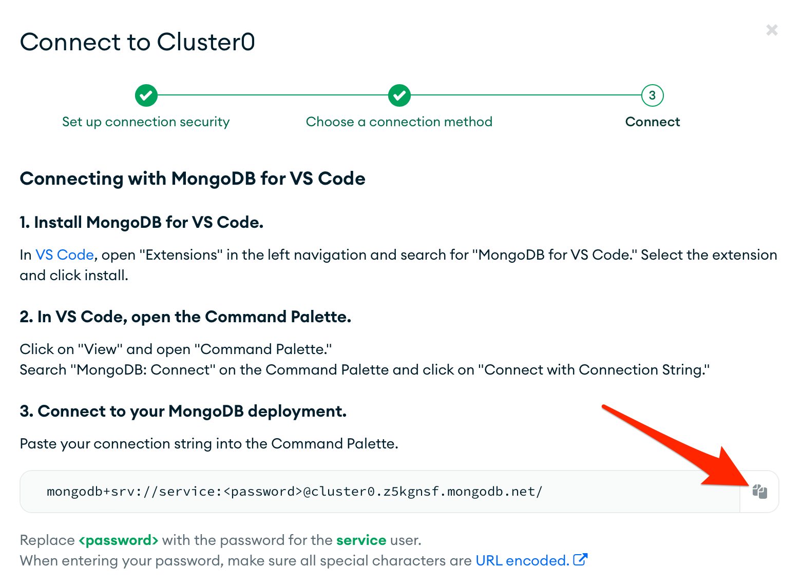

15. Next, we'll grant network access from AWS via static IP. Click `Network Access` in the side nav menu.

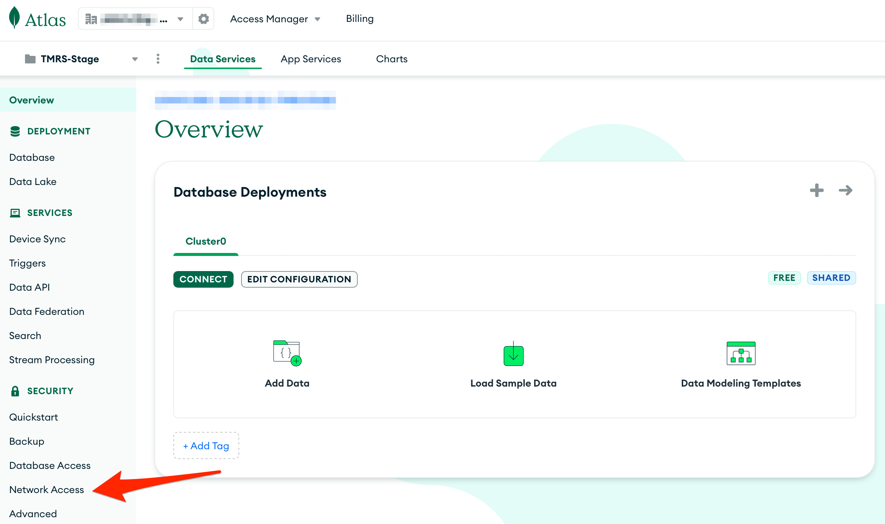

12. Make note of project name selected and copy the associated `whitelist_ip` address our generated for this environment. NOTE: There will be different IP addresses for each environment.

13. Click `+ Add IP Address`

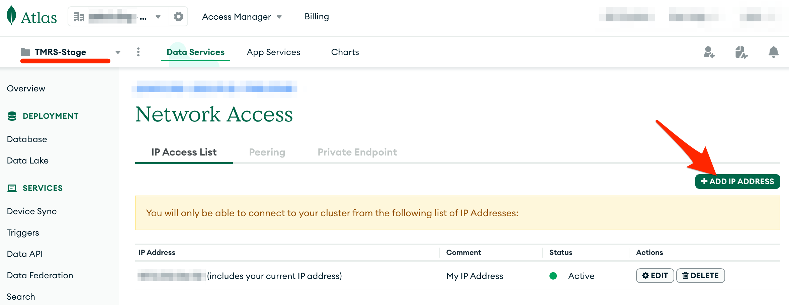

13. Paste the `whitelist_ip` for the associated environment in `Access List Entry` and using the naming convention enter into `Comment` the project name - i.e. `<PROJECT PREFIX>-<Environment>`. The figure below shows an example configuration for the stage pipeline.

14. Click `Confirm`

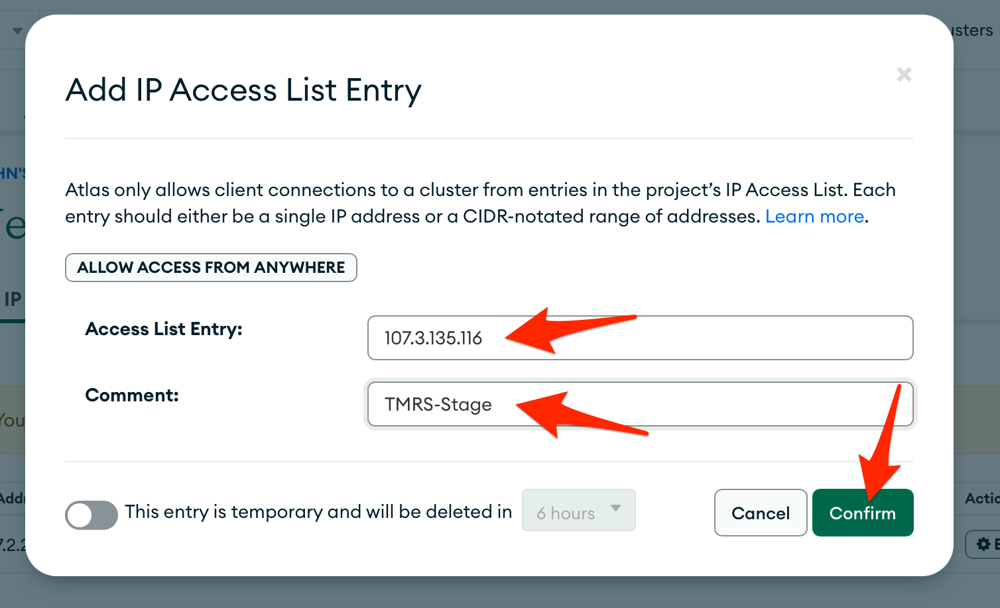

## Repeat the same process for additional databases

You've created the STAGE database, now step through the entire process again to create a second MongoDB project with the same naming convention `<PROJECT PREFIX>-<Environment>` i.e.: `TMRS-Prod`.

Follow `Steps 1 to 14` in the section above [Creating DBs for Each Environment](#creating-dbs-for-each-environment) so that you have 2 mongo connection strings stored in a safe place for use in other repos.

## Clean Up: Optional

Remove the empty `Project 0` project.

1. Select the `Projects` drop down and click `View All Projects`

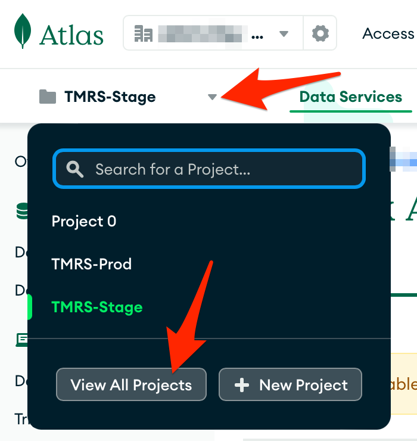

2. In the `Project 0` row, click the `Trash` icon.

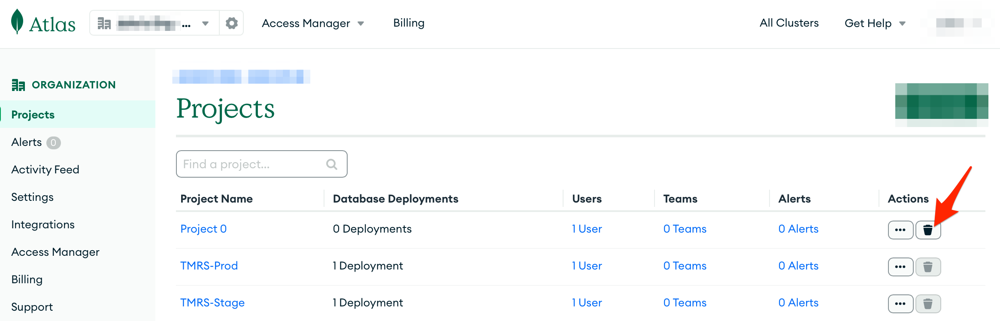

3. Confirm the project name and click `Delete Project`

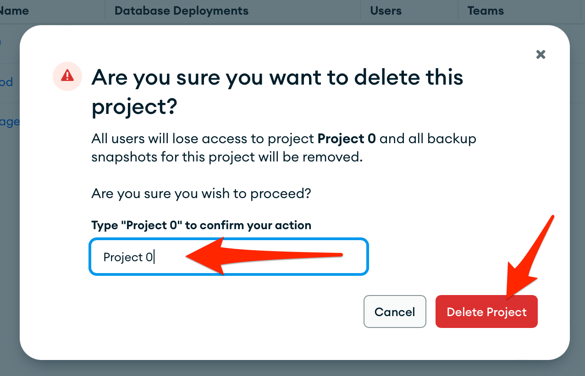