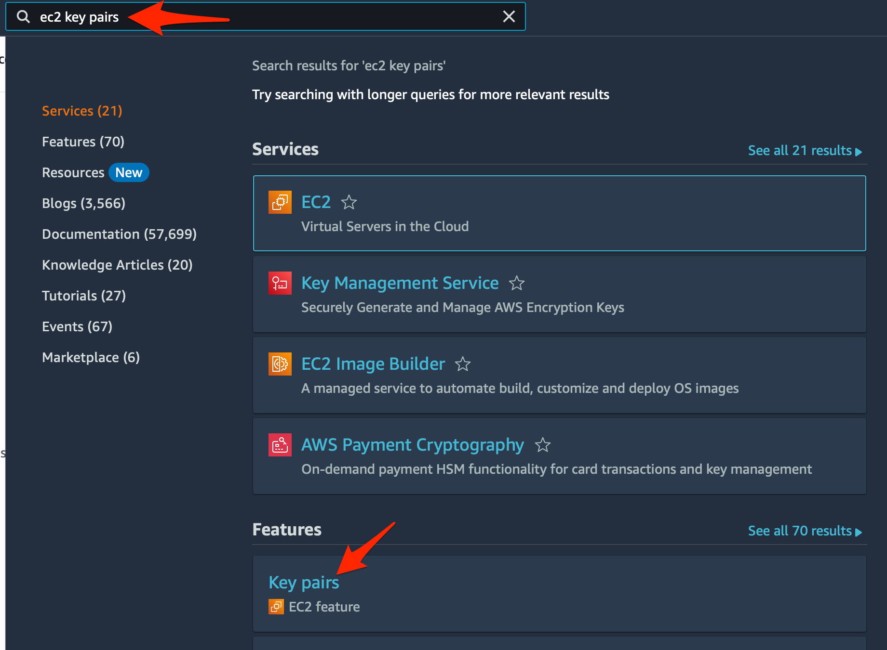
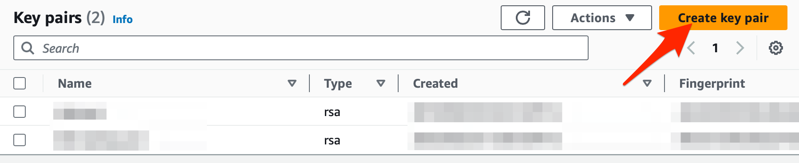
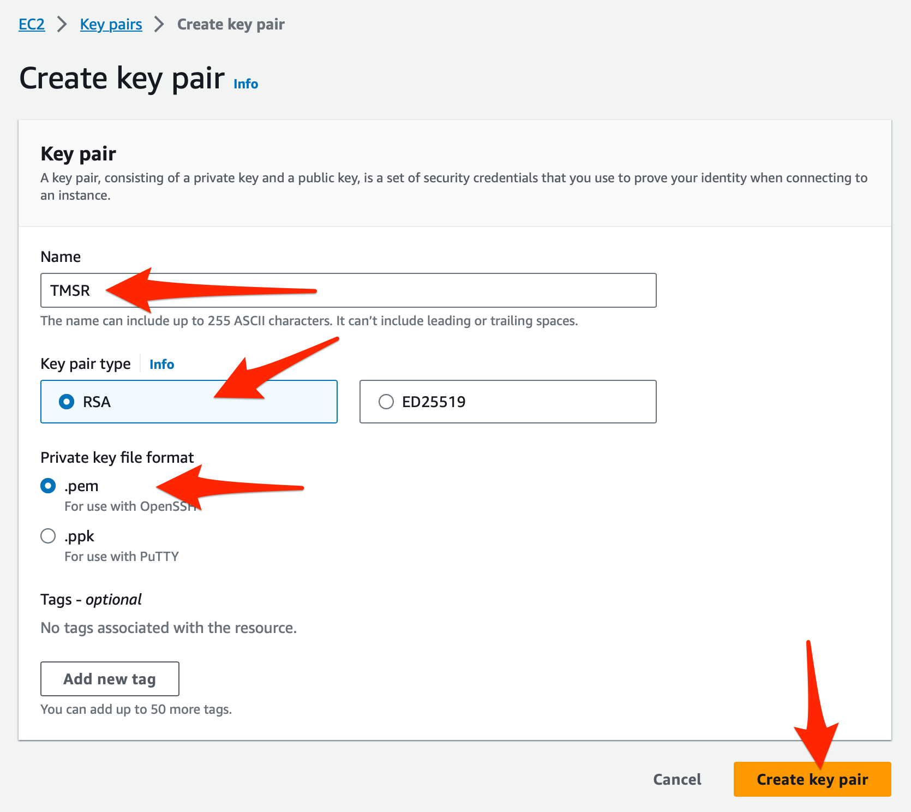

# AWS SSH Key Pair

[Prereqs](../README.md)

## Best Security Practices

Never store any files or pieces of information that contain credentials or keys! You'll expose your data and infrastructure to nefarious actors, and could lead to unwanted AWS fees.

## Create Virtual Machine SSH Keys

If your organization doesn't have an AWS account coordinator/administrator that can provide SSH `.pem` files, use the following steps to generate a one to secure access from your EC2 instances to external resources (i.e. GitHub) and to enable provisioning capabilities.

1. Search for `ec2 key pairs` and click on the search result `Key pairs`<br />
<br />

2. Click `Create key pair` <br /><br />

3. Name your key pair, using the `AWS_PROFILE` name you decided on. **This value is case-sensitive so be sure to enter it exactly the same**. Any deviation in case will sever the connection between EC2 and it's external access to resources.

4. Select `RSA` encryption and the `.pem` file format.<br/>

5. Click `Create key pair` and the resulting `.pem` file will be downloaded to your system. It will be named `<AWS_PROFILE>.pem` **Make sure the `.pem` file is not saved in your code. Anyone with access to this file can access your EC2 instances** Store this file in a safe location that is backed up.<br/>
<br />

6. Generate a public key from your `.pem` file with the following terminal commands and substituting `<AWS_PROFILE>` with your profile name:

``` bash
chmod 600 <AWS_PROFILE>.pem
ssh-keygen -y -f <AWS_PROFILE>.pem > <AWS_PROFILE>.pub
```

7. Save the resulting `.pub` file. It's contents should look similar to: <br />

``` text
ssh-rsa DGSRGRGGzaC1yc2EAAAADAQABAAABAQCRNP1ubejeD2ljE8agQSVXau82muLyE1es9VC8iTzsnsDe93BF48axahUv0x782eKslXPjAsaPt0PZdLcAaHDHfmuUxTbaRQwl2O0utU/K6GnM1XuiUjx1zLyMPZfrKHklJ3W3fWtPFmBKc9/h5OYnAocQkuZR/72aoFAGgZOAFR8t88FDFp73Y6dBIneWIj2oeLWymHzVyNi5TKrfzHkVgx5iM2CfGHuJkam5Qc3RHmwYj2gc2UsthlpS0Gy5f6HEbZippRDY5qWbIkijpLlVhILfRwW/iAlaCZt/wJQ6cWYwPqkBNBPjoRPuBjhHfxEfGwqfrDTOZHu8gAM4gmhfbQaB4n
```

8. Save the resulting `.pub` file with your `AWS_ACCESS_KEY_ID`, `AWS_SECRET_ACCESS_KEY`, and `.pem` file in a safe and secured location outside of this repo. Anyone with access to this information will have full control over your infrastructure.
